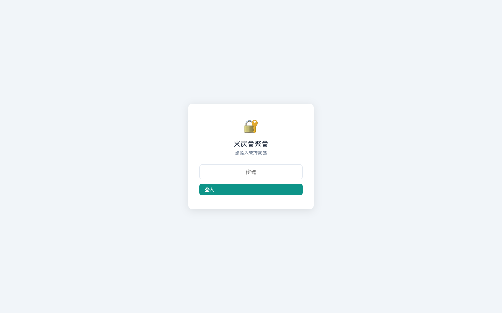
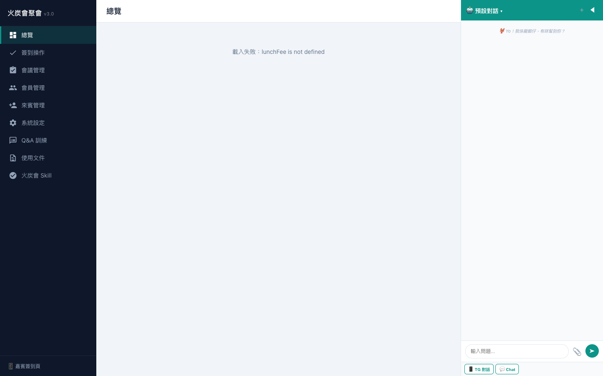
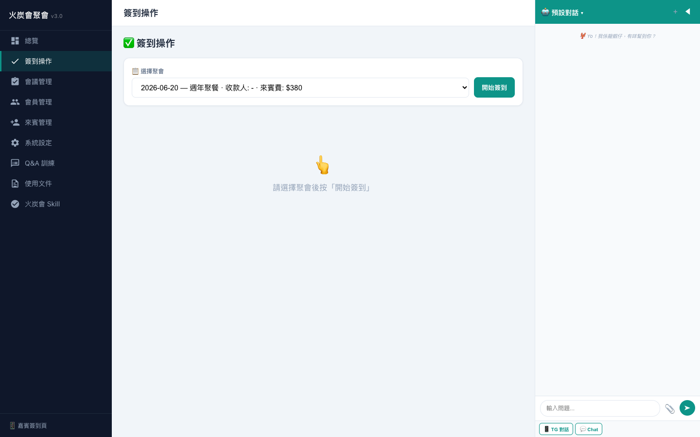
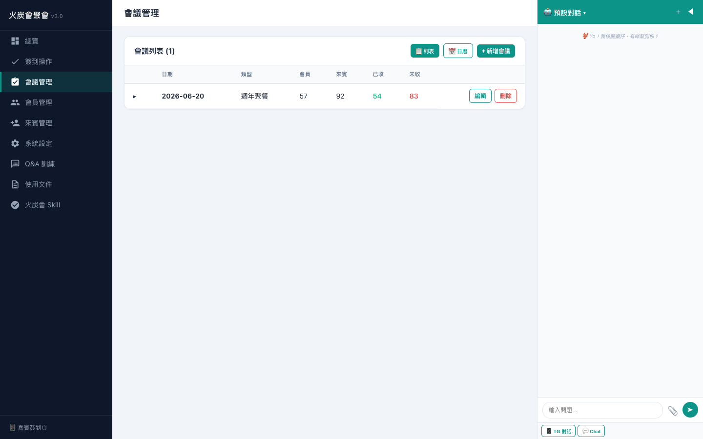
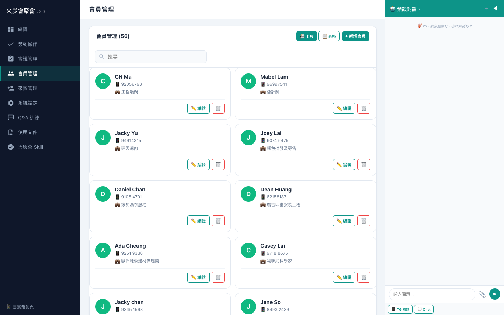
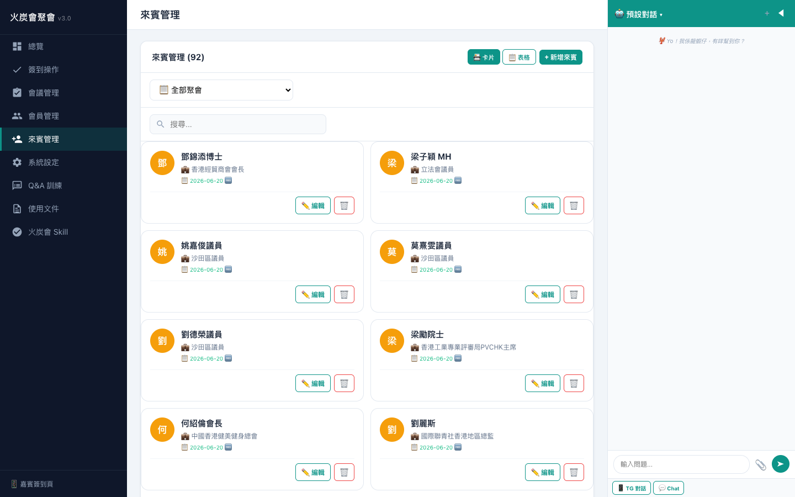
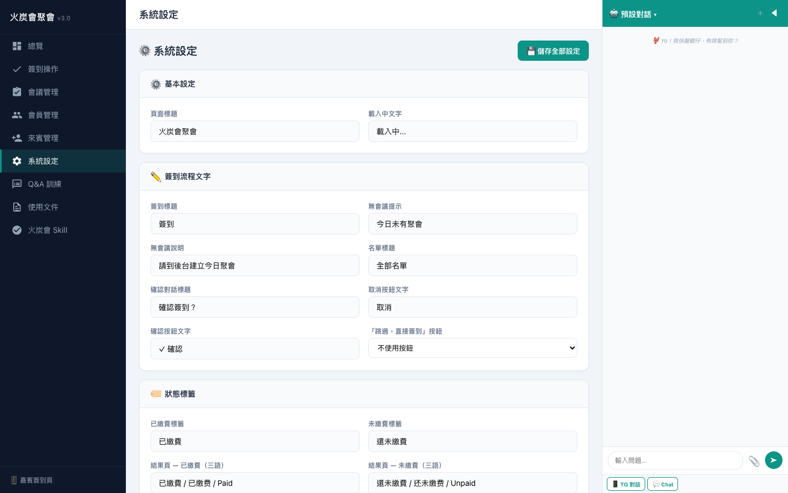
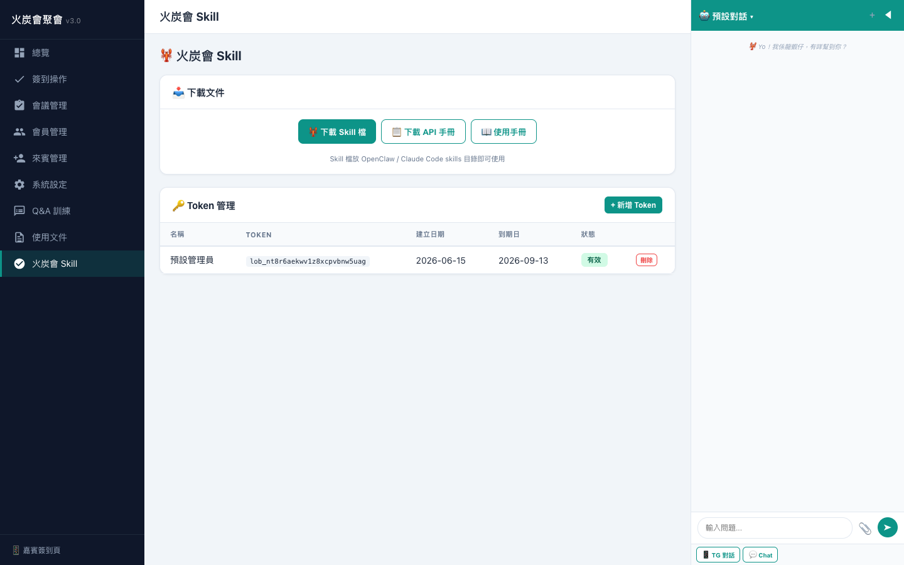
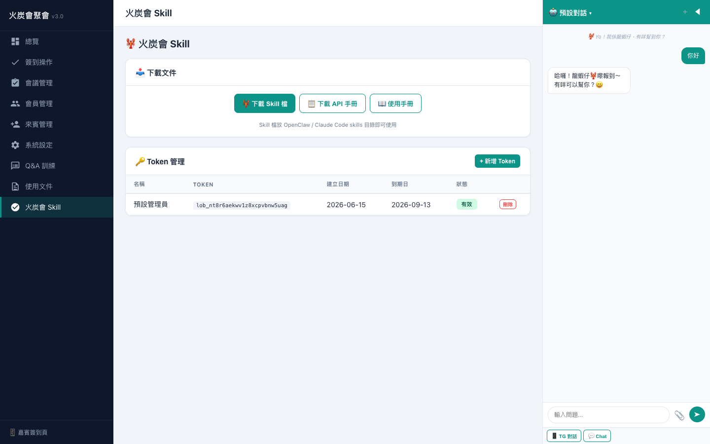

# 後台管理手冊 v3.5

## 登入

1. 開啟 **https://fotan.techforliving.net/admin**
2. 輸入管理密碼

---

## 總覽

只顯示**當前會議**關鍵數據：
- 📅 會議日期 + 類型
- 👥 出席人數（總數、會員、來賓、已簽到）
- 💰 收款（已收人數、未收人數、收費標準）
- 📊 付款分佈甜甜圈圖
- 📋 收入摘要（會員/來賓/已收/未收明細）

---

## 簽到操作

- **點擊人物卡片** → 自動記錄當前時間 + 彈出操作模態頁
- **點擊付款 badge** → 付款模態頁（💵現金 / 📤憑證付費 / 🆓免費）
- **✕ 按鈕** → 標記缺席

---

## 會議管理

- 列表/日曆雙模式
- 5 個收費欄位：委員價、會員價、來賓價、早鳥價、臨場價
- 展開出席名單（A-Z），支援付款篩選
- 新增會議可複製上次會員

---

## 會員管理

- 56 個活躍會員，卡片/表格雙模式
- 編輯：名稱、電話、電郵、專業、角色、會費日、簡介
- 付款憑證上傳（支援多張）
- 出席歷史

---

## 來賓管理

- 表格模式含付款狀態欄位（💰已付 / 🆓免費 / ❌💰未付）
- 卡片模式顯示出席記錄

---

## 系統設定

| 區塊 | 內容 |
|------|------|
| ⚙️ 基本設定 | 頁面標題、載入文字 |
| ✏️ 簽到流程 | 簽到標題、跳過按鈕開關 |
| 🍽️ 午餐與節目 | 午餐費、枱號、時間表、主席話 |
| 💳 付款連結 | PayMe/Alipay/FPS 連結、QR 碼 |
| 🔐 密碼 | 修改管理密碼 |
| 💿 備份 | 一鍵下載 JSON |

---

## 火炭會 Skill

- 📥 下載 Skill 檔 / API 手冊 / 使用手冊
- 🔑 Token 管理（90 天有效）
- Skill API 17 種操作，全部有 curl 範例

---

## 多層收費

| Tier | 判定 | 欄位 |
|------|------|------|
| 委員 | role != '會員' | committee_fee |
| 會員 | role = '會員' | member_fee |
| 來賓 | person_type='guest' | guest_fee |
| 早鳥 | price_tier='early_bird' | early_bird_fee |
| 臨場 | price_tier='walk_in' | walk_in_fee |

---

## Chatbot 面板

- 💬 港式廣東話 AI（21 tools）
- 📎 Excel 自動導入 / 圖片 AI 分析
- 📱 TG 對話記錄
