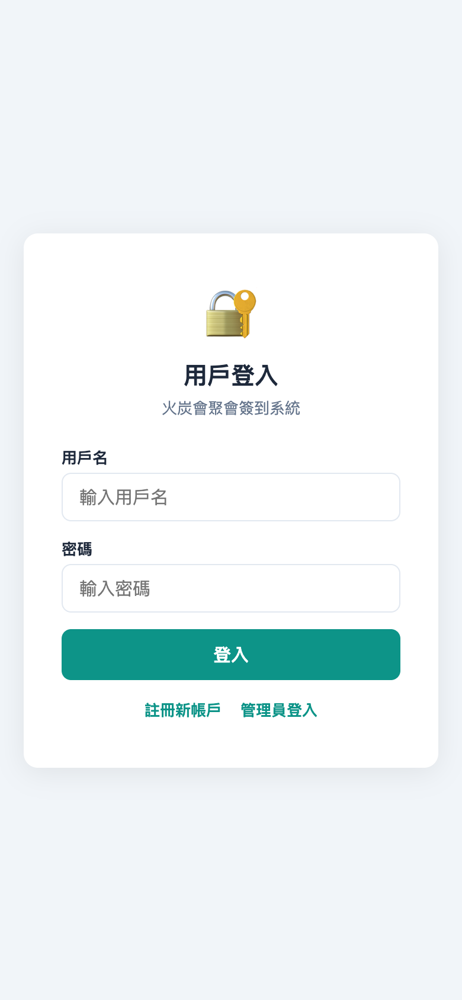
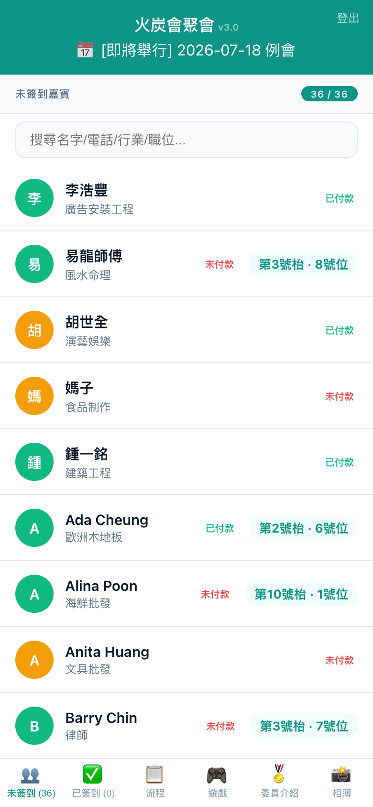
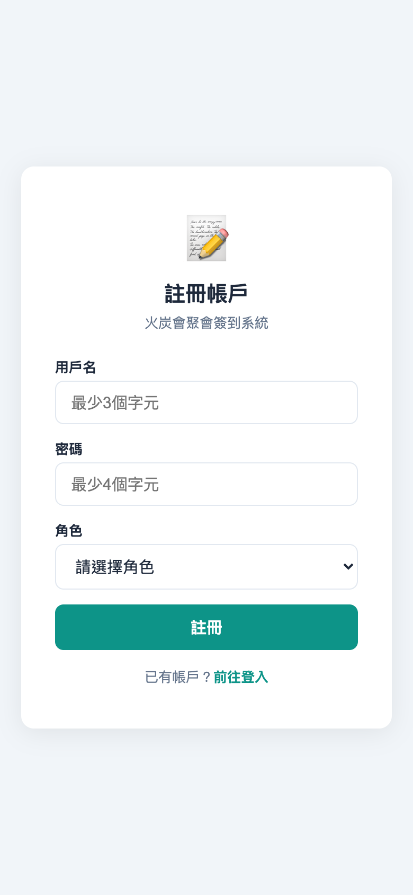

# 火炭會聚會簽到系統 — 使用手冊 v3.15

## 系統概述

火炭會聚會簽到系統是一個專為商會聚會設計的簽到管理平台，支援手機簽到、多種付款方式、即時統計。

**主頁**：https://fotan.techforliving.net  
**登入**：https://fotan.techforliving.net/login.html  
**後台**：https://fotan.techforliving.net/admin

---

## 一、主頁簽到流程

### 1.1 未簽到名單
進入主頁後，底部 tab 預設顯示「未簽到」名單。所有人按 A-Z 排列，顯示姓名、付款狀態、枱號。

### 1.2 點擊簽到
點擊人名 → 若已付款則彈出確認框 → 按「✓ 確認」完成簽到。

### 1.3 付款頁面
若未付款，點擊後會顯示付款頁面，包含：
- **PayMe** — 直接跳轉付款
- **Alipay** — 顯示 QR Code 供掃描
- **FPS 轉數快** — 顯示 QR Code + 收款電話
- **上傳付款憑證** — 選擇截圖上傳確認

### 1.4 已完成簽到
付款確認後，顯示「多謝光臨」及枱號資訊。

### 1.5 已簽到名單
底部 tab 切換至「已簽到」，查看所有已完成簽到的人員。

---

## 二、個人資料卡

在「已簽到」tab 點擊任何人，彈出個人資料卡：
- 頭像、姓名、枱號
- 💼 專業、🏅 角色（委員/會員）
- 📝 會員簡介
- 📱 電話（點擊可直接撥打）
- 📧 電郵
- 📇 **加入通訊錄 (vCard)** — 下載 .vcf 檔案，直接加入手機電話簿

---

## 三、底部 Tab Bar

| Tab | 功能 |
|-----|------|
| 👥 未簽到 | 顯示尚未簽到的人員 |
| ✅ 已簽到 | 已簽到名單，點擊查看個人資料卡 + vCard |
| 📋 流程 | 節目時間表 + 主席的話 |
| 🏅 委員 | 委員介紹 |
| 🎮 遊戲 | 遊戲資訊 |
| ℹ️ 關於 | 火炭會介紹 + 申請入會連結 |

---

## 四、用戶登入/註冊

### 4.1 登入
用戶可通過 `/login.html` 登入系統。

### 4.2 註冊
新用戶可通過 `/register.html` 註冊帳戶，需等待管理員批核後方可使用。

---

## 五、付款方式

| 方式 | 說明 |
|------|------|
| PayMe | 點擊直接跳轉 PayMe 付款 |
| Alipay HK | QR Code 掃碼付款 |
| FPS 轉數快 | QR Code + 收款電話，支援銀行 App 掃碼 |
| 上傳憑證 | 截圖上傳由管理員確認 |

---

## 六、簽到規則

1. **未付款者**：點擊後直接跳轉付款頁面，必須完成付款方可簽到
2. **已付款者**：點擊後彈出確認框，確認後立即簽到
3. **免費嘉賓**：直接簽到，無需付款
