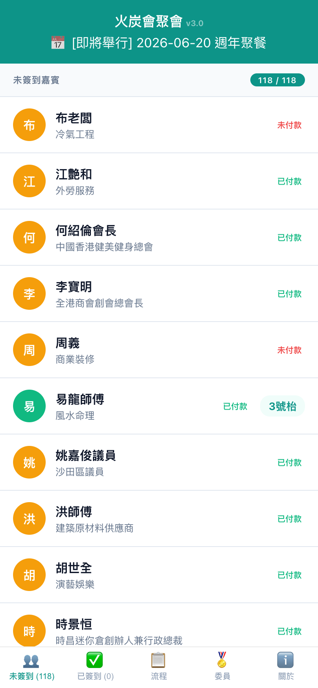
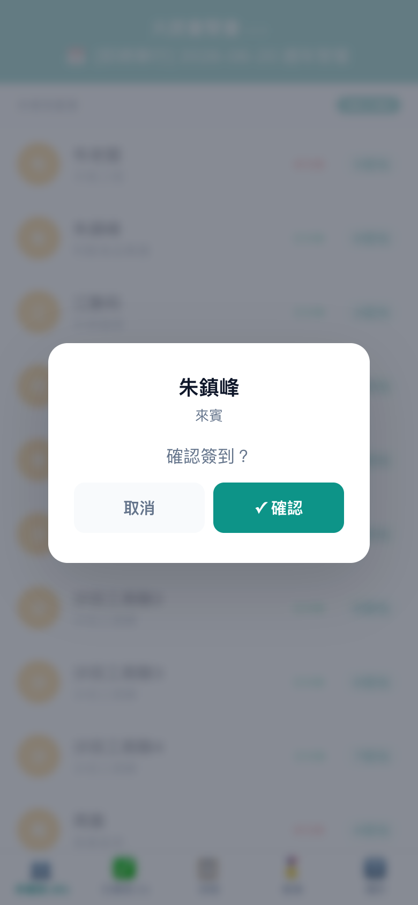
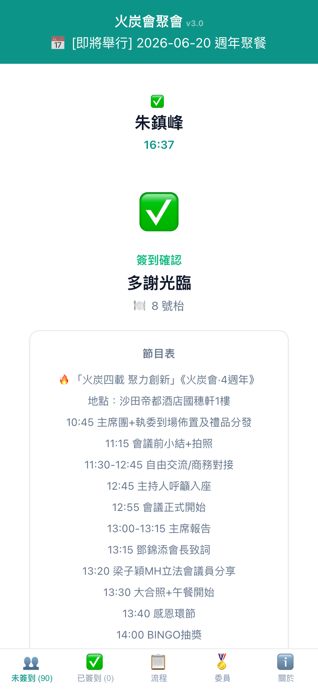
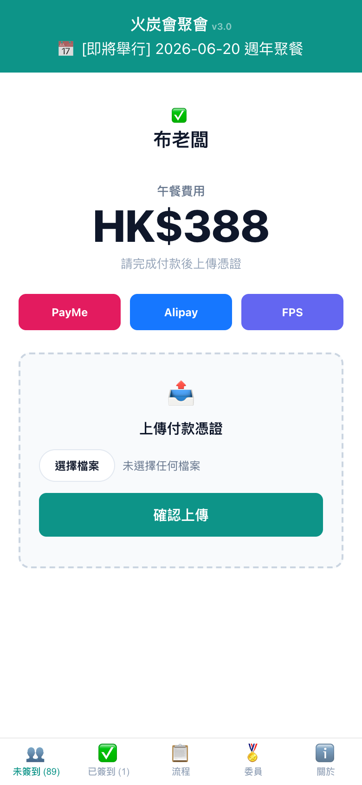

# 使用手冊 v3.7 — 嘉賓簽到主頁

## 開啟主頁

手機或電腦開啟 **https://fotan.techforliving.net**

## 簽到流程

### 1. 瀏覽未簽到嘉賓
底部 tab bar 預設顯示「未簽到」名單，按 A-Z 排列。每人顯示姓名、會員/來賓標籤、付款狀態、枱號。

### 2. 未付款 → 付款頁面
點擊未付款嘉賓 → 直接跳到付款頁面：

- **PayMe** — 點擊跳轉 PayMe 付款
- **Alipay** — 顯示 QR Code
- **FPS 轉數快** — 顯示 QR Code
- **上傳付款憑證** — 選擇截圖上傳
- **跳過，直接簽到** — 不付款完成簽到（可由後台開關）

### 3. 已付款 → 確認簽到
點擊已付款嘉賓 → 彈出確認對話框 → 按「✓ 確認」→ 播放簽到音效

### 4. 簽到完成
顯示「多謝光臨」、枱號、節目表、主席的話。

## 底部 Tab Bar

| Tab | 功能 |
|-----|------|
| 👥 未簽到 | 尚未簽到的人（A-Z） |
| ✅ 已簽到 | 已簽到名單，點擊看資料卡 |
| 📋 流程 | 節目時間表 + 主席的話 |
| 🏅 委員 | 委員介紹 |
| ℹ️ 關於 | 火炭會介紹 + 申請入會 |

## 已簽到 + 個人資料卡

在「已簽到」tab 點擊任何人：

彈出資料卡：

- 頭像、姓名、枱號
- 💼 專業、🏅 角色
- 📱 電話（點擊撥打）
- 📧 電郵
- 📇 **加入通訊錄 (vCard)** — 下載 .vcf 加入手機電話簿

## 付款狀態

| 顯示 | 意思 |
|------|------|
| 已付款 | 已成功付款 |
| 未付款 | 尚未付款，點擊跳到付款頁 |
