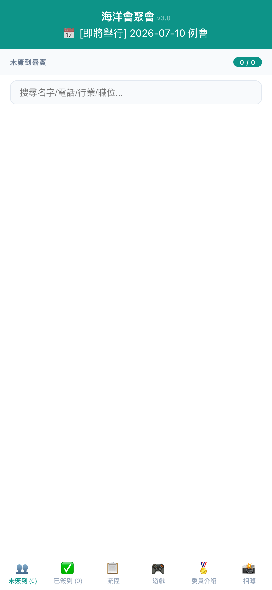
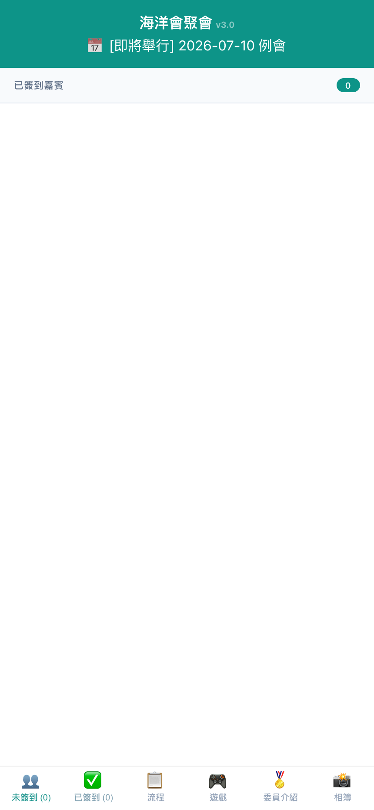
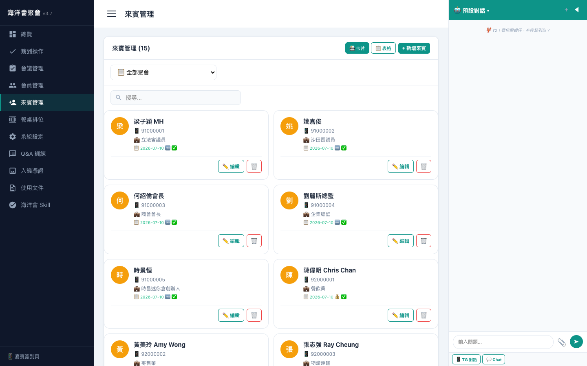

# 火炭會聚會簽到系統 — 使用手冊 v3.14

## 快速開始

1. 開啟瀏覽器，前往 **https://fotan.techforliving.net**
2. 手機用戶：點擊「分享」→「加到主畫面」安裝 PWA
3. 來賓簽到用主頁，管理員用 `/admin` 後台

---

## 第一章：來賓簽到（主頁）

### 1.1 簽到頁面

打開網站後，系統自動載入今日會議。底部有 6 個分頁：

| 分頁 | 功能 |
|------|------|
| 👥 未簽到 | 未簽到人員名單，頂部搜尋欄可搜姓名/電話/行業 |
| ✅ 已簽到 | 已簽到人員名單，顯示枱號 |
| 📋 流程 | 今日節目時間表 + 主席歡迎詞 |
| 🎮 遊戲 | 互動遊戲資訊 |
| 🏅 委員介紹 | 委員介紹內容 |
| 📸 相簿 | 活動相簿連結 |

### 1.2 簽到流程

1. 在「未簽到」分頁找到自己（可用搜尋欄快速定位）
2. 點擊自己的卡片
   - **已付款** → 彈出確認對話框 → 點擊確認完成簽到
   - **未付款** → 顯示付款頁面（PayMe / Alipay / FPS / 收據上傳）
3. 付款完成後自動標記已付，回到簽到流程

### 1.3 付款方式

| 方式 | 操作 |
|------|------|
| PayMe | 點擊 → 自動跳轉 PayMe App |
| Alipay HK | 點擊 → 顯示 QR Code 掃描 |
| FPS 轉數快 | 點擊 → 顯示 QR Code 或手動輸入電話 |
| 上傳收據 | 點擊 → 拍照/選取截圖 → 系統自動標記已付款 |
| 跳過簽到 | 直接完成簽到（需管理員啟用） |

### 1.4 已簽到名單

簽到後系統顯示：
- 枱號 + 座位號
- 今日節目表
- 主席歡迎詞

Cookie 記住簽到狀態，重新整理不會重複簽到。

---

## 第二章：管理後台

### 2.1 登入

前往 `https://fotan.techforliving.net/admin`，輸入管理員密碼。Session 24 小時有效。

### 2.2 總覽（Dashboard）

登入後首頁顯示：
- Chart.js 付款分佈甜甜圈圖
- 人數統計卡片（總出席、委員、會員、⭐嘉賓、👥來賓、已簽到）
- 營收統計（已收/預期）
- 付款狀態（已付/免費/未付）
- 右側 AI 助手「龍蝦仔」🦞

### 2.3 簽到操作

1. 選擇會議（下拉選單）
2. 人員按類別分組：委員 → 會員 → 嘉賓 → 來賓
3. **簽到**：點擊人員自動簽到（記錄當前時間）
4. **付款**：點擊付款狀態 → 彈出選單（現金/收據上傳/免費/未付）
5. **標記缺席**：點擊「缺席」按鈕
6. ⚠️ 記得按「儲存簽到記錄」持久化

右上角可切換卡片/表格檢視模式。

### 2.4 會議管理

- **建立會議**：日期、類型（例會/特別會議/週年慶）、各級費用
- **編輯會議**：修改費用、枱數、收款人
- **刪除會議**：⚠️ 連同全部出席記錄刪除
- **複製上期出席**：將上期會員出席名單複製到新會議

### 2.5 會員管理

- **新增**：姓名（必填）、電話、email、行業、角色、標籤、簡介
- **編輯**：修改任何欄位，支援標籤分類（素食、長老、需要翻譯等）
- **刪除**：軟刪除（active=0），歷史記錄保留
- **收據上傳**：支援多張會費繳交收據
- **出席歷史**：查看過往所有出席記錄

角色說明：主席 / 副主席 / 秘書長 / 幹事 / 會員（委員收費 $220，會員 $398）

### 2.6 來賓管理

- **新增**：姓名、行業、電話、邀請人、⭐ VIP 標記、付款狀態
- **VIP 嘉賓**：勾選 VIP 後自動免費，顯示 ⭐ 標記
- **批次匯入**：JSON 格式，自動建立 attendance 記錄
- **會議篩選**：按會議過濾來賓

### 2.7 餐桌排位

基本操作：
1. 選擇枱數（1-20）及每枱人數上限
2. 拖放人員卡片到目標枱號
3. 雙擊枱名可重新命名（VIP 枱、主家席、嘉賓枱等）
4. 排位即時同步至簽到頁面

進階功能：
- **自動排位**：選分組（委員/VIP/會員/來賓/標籤/姓氏）→ 一鍵自動分配
- **整枱搬人**：指定來源枱 → 目標枱
- **自由位置**：畫布上自由擺放卡片

### 2.8 系統設定

| 類別 | 設定項目 |
|------|----------|
| 基本 | 午餐費用、主席訊息、關於我們 |
| 簽到 | 直接簽到開關、簽到說明文字 |
| 付款 | PayMe 連結、FPS 電話、Alipay/FPS QR |
| 內容 | 節目流程表、遊戲資訊、委員介紹、相簿連結 |
| 通訊 | WhatsApp 提醒範本、Telegram Bot |
| 安全 | 密碼變更、API Token 管理 |
| 資料 | 完整資料庫 JSON 備份下載 |

---

## 第三章：AI 助手「龍蝦仔」🦞

右下角折疊面板，用粵語對話操作系統：

- 「今日有幾多人出席？」
- 「幫陳大文簽到」
- 「將 VIP 排去 1 號枱」
- 「今日營收幾多？」
- 「列出未付款嘅來賓」
- 「將所有委員放同一枱」

支援上傳圖片自動 OCR 辨識。

---

## 第四章：常見問題

**Q: 為什麼簽到時說「未付款不能簽到」？**
系統要求先付款。可透過 PayMe/Alipay/FPS 付款，或由管理員標記「免費」。

**Q: 如何跳過付款直接簽到？**
管理員在「系統設定」→ 開啟「直接簽到」（skipCheckin）。

**Q: 簽到後可取消嗎？**
可以。管理員在簽到操作頁面刪除該 attendance 記錄。

**Q: 排位後簽到頁看不到枱號？**
重新整理簽到頁面即可同步。

**Q: 如何安裝 PWA？**
iOS Safari → 分享 → 加到主畫面。Android Chrome → 選單 → 安裝應用程式。

**Q: 系統支援多少人？**
無上限，Cloudflare Edge 全球加速。

---

## 快捷參考

| 網址 | 用途 |
|------|------|
| `fotan.techforliving.net` | 來賓簽到頁面 |
| `fotan.techforliving.net/admin` | 管理後台 |
| `fotan.techforliving.net/api/doc` | API 文件 |
